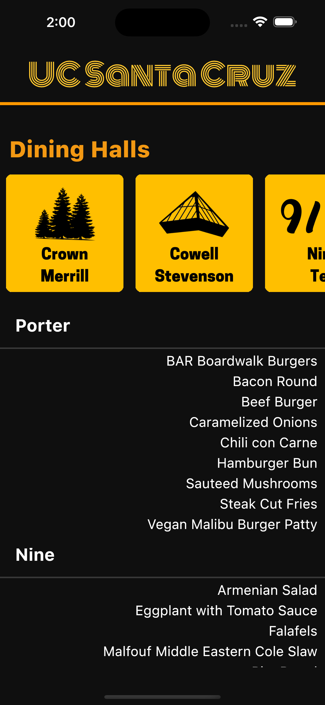
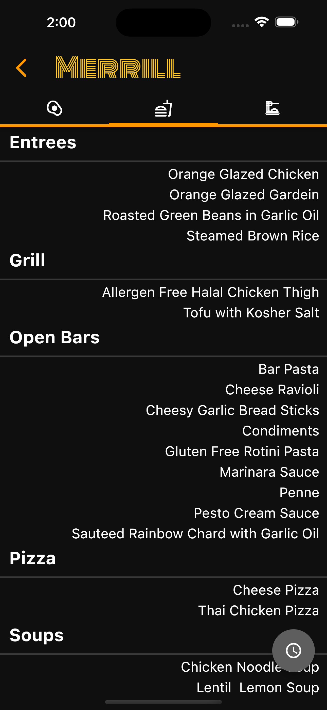
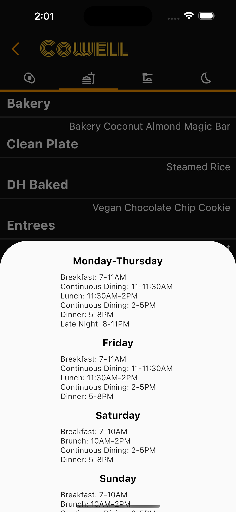
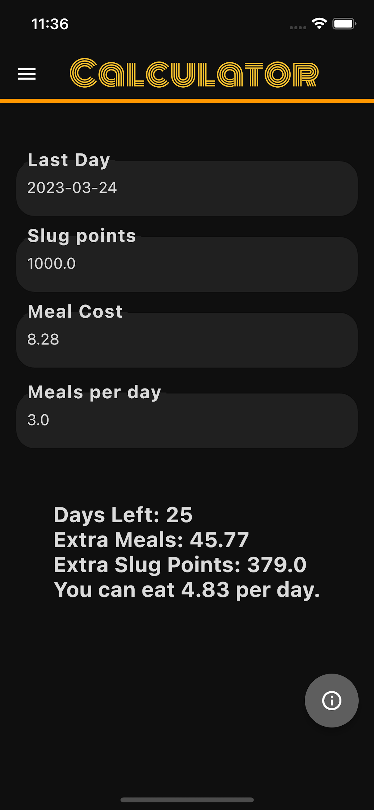
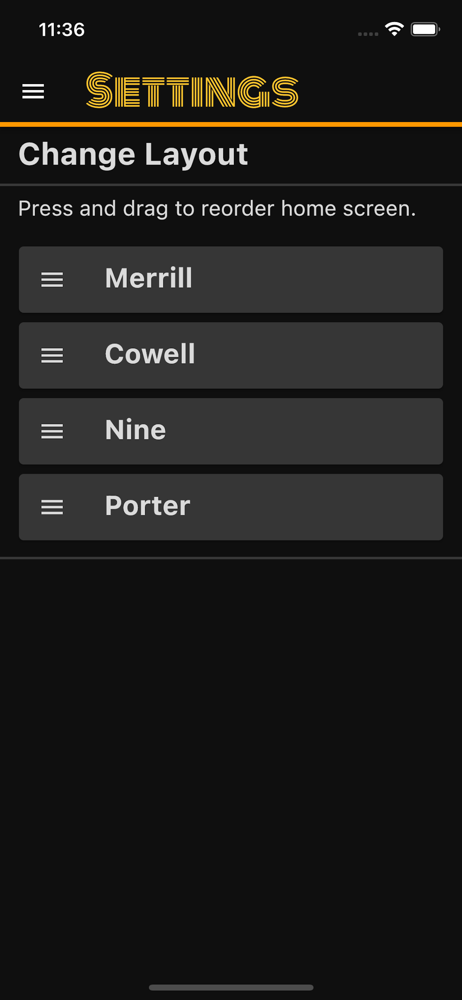

# UCSC Menu – Dining Hall App

Menu app for all UC Santa Cruz Dining Locations created with Flutter.
* [App Store](https://apps.apple.com/us/app/ucsc-menu/id1670523487?itsct=apps_box_badge&itscg=30200)
* [Google Play Store](https://play.google.com/store/apps/details?id=com.orderOfTheCone.android.menu_app&pcampaignid=pcampaignidMKT-Other-global-all-co-prtnr-py-PartBadge-Mar2515-1)

### Authors
* [Eliah Reeves](https://github.com/nunibye)
* [Christian Knab](https://github.com/christianknab)

### Contact us
To contact us for suggestions, feedback, bugs, etc., reach us at ucscmenuapp@gmail.com!

## Table of Contents
* [General Info](#general-info)
* [Technologies](#technologies)
* [Features](#features)

## Images

  
 

## General Info

We wanted to create an organized dining hall app for UCSC students to quickly check the menus at the different dining hall locations.
Supported on Android and iOS.

## Technologies

* Dart
* Python 3

## Features
* A summary is provided on the homescreen for quick viewing.
* Click the specific dining hall for a detailed list of all food items.
* Switch between Breakfast, Lunch, Dinner, and Late Night.
* Automatically displays meal time based on time of day.

### To Do:
* Organize order of meal category.
* Add settings to change order hall is displayed in.
* Figure out more comprehensive summarizer.
* Slug points calculator.
* Add the ability to review and comment on individual dining hall food.
