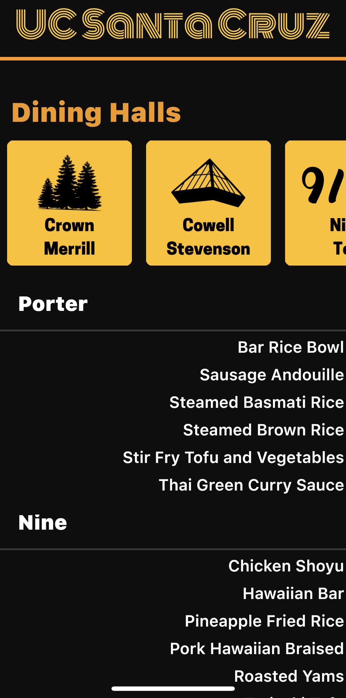
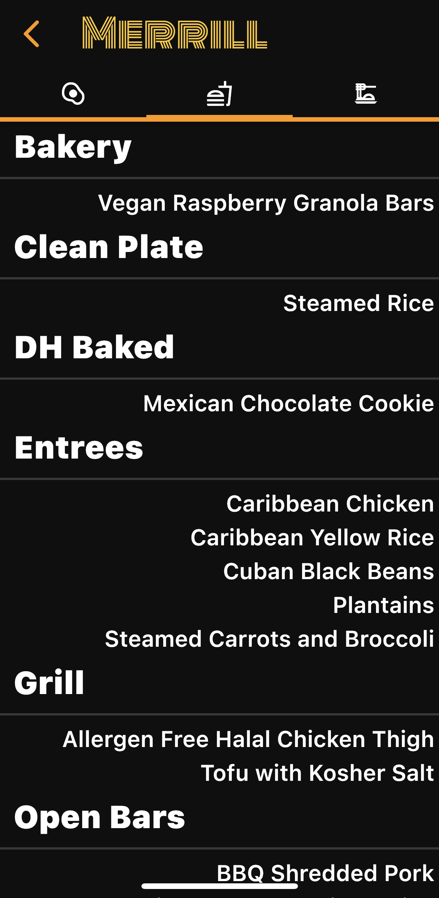

# UCSC Menu – UCSC Dining Hall App

Menu app for all UC Santa Cruz Dining Locations created with Flutter.

 

## Table of Contents
* [General Info](#general-info)
* [Technologies](#technologies)
* [Future Updates](#features)

## General Info

We wanted to create an organized dining hall app for UCSC students to quickly check the menus at the different dining hall locations.

## Technologies

* Dart
* Python 3

## Features
* A summary is provided on the homescreen for quick viewing.
* Click the specific dining hall for a detailed list of all food items.
* Switch between Breakfast, Lunch, Dinner, and Late Night.
* Automatically displays meal time based on time of day.

### To Do:
* Add text when menu was last updated.
* Run menu scraper autonomously.
* Add dining hall hours info tab.
* Organize order of meal category.
* Add settings to change order hall is displayed in.
* Figure out more comprehensive summarizer.
* Slug points calculator.
* Add the ability to review and comment on individual dining hall food.
