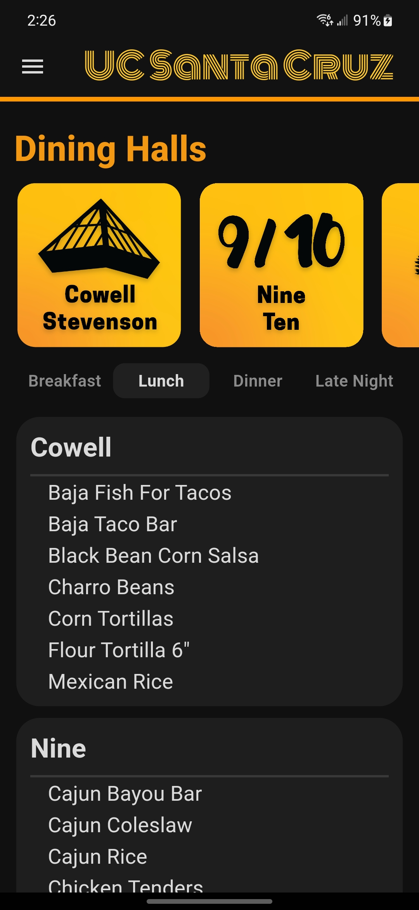
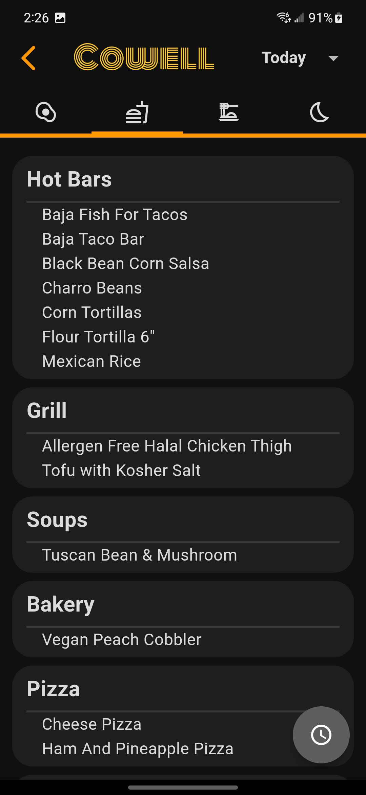
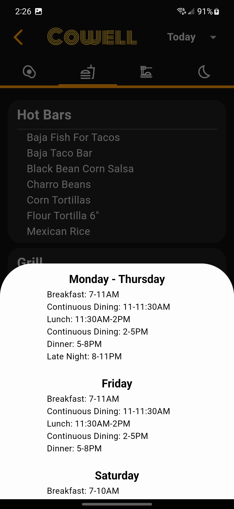
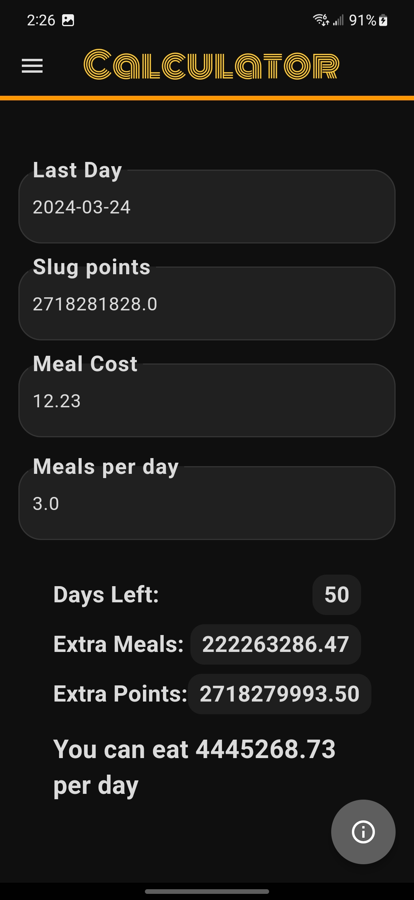
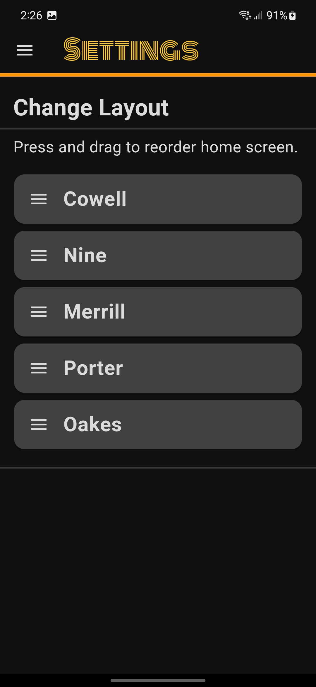

# UCSC Menu – Dining Hall App

Menu app for all UC Santa Cruz Dining Locations created with Flutter.
* [App Store](https://apps.apple.com/us/app/ucsc-menu/id1670523487)
* [Google Play Store](https://play.google.com/store/apps/details?id=com.orderOfTheCone.android.menu_app)

### Authors
* [Eliah Reeves](https://github.com/nunibye)
* [Christian Knab](https://github.com/christianknab)
* [Eric Chuang](https://github.com/ericbreh)
### Contact us
To contact us for suggestions, feedback, bugs, etc., reach us at conetechnologiesdev@gmail.com

<!-- ### Support us
* [Buy us a Coffee!](https://www.buymeacoffee.com/christiantknab) -->

## Table of Contents
* [General Info](#general-info)
* [Technologies](#technologies)
* [Features](#features)

## Images

  
 

## General Info

We wanted to create an organized dining hall app for UCSC students to quickly check the menus at the different dining hall locations. This app currently has around 2.5k users and has been featured in an article by City on a Hill Press.
Supported on Android and iOS.

## Technologies

* Dart
* Python 3
* Go
* Google AdMob Monetization
* Firebase Realtime Database
* Firebase analytics
* Firebase Functions

## Features
* A summary is provided on the homescreen for quick viewing.
* Click the specific dining hall for a detailed list of all food items.
* Switch between Breakfast, Lunch, Dinner, and Late Night.
* Automatically displays meal time based on time of day.
